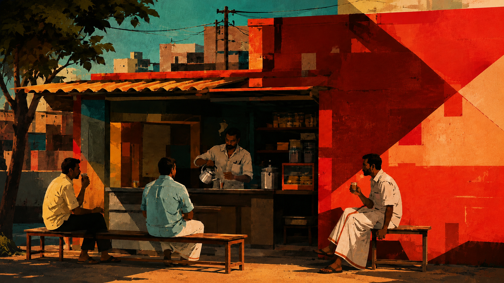

# 📻 Tea Kadai Radio (டீ கடை ரேடியோ)

Tea Kadai Radio is a beautiful, nostalgic web-based radio player that brings the ambient vibe of a traditional Tamil tea shop ("Tea Kadai") to your screen. The player features a hand-curated catalog of iconic Tamil melodies, lo-fi tracks, and retro hits across different moods, complete with visual aesthetic details like a spinning vinyl record, a tuning dial, a live listener simulation, and a grainy visual overlay.



## ✨ Features

- **Nostalgic Playlists**: Hand-curated Tamil tracklists sorted by mood:
  - 💖 **Kaadhal (காதல்)** — Romantic, soothing melodies.
  - 🌙 **Ninaivugal (நினைவுகள்)** — Emotional late-night retro nostalgia.
  - 📻 **Pazhaya Paattu (பழைய பாட்டு)** — Classic Ilaiyaraaja, folk, and classical vintage tracks.
  - 🕺 **Kuthu (குத்து)** — Energetic, high-tempo beats.
- **Spinning Vinyl Artwork**: A rotating vinyl record visualizer that spins during active playback and slows down when paused.
- **Interactive Tuner**: A styled dial and progress bar resembling classic transistor radios.
- **Dynamic Backgrounds**: Responsive layout adapting between wide and tall setups depending on the viewport aspect ratio.
- **Grain & Overlay Effects**: CRT-style Scanline/Grain overlay to enhance the vintage, retro analog television feel.
- **Simulated Community Listener Count**: Real-time simulation of online listeners, capturing the shared experience of tuning in together.
- **Integrated YouTube Iframe Player**: Seamless background streaming using the YouTube API, handling stream initialization, buffering, and fallback gracefully.

## 🛠️ Tech Stack

- **Framework**: [Next.js](https://nextjs.org/) (App Router)
- **Frontend library**: [React](https://react.dev/)
- **Language**: [TypeScript](https://www.typescriptlang.org/)
- **Styling**: [Tailwind CSS](https://tailwindcss.com/) & custom CSS
- **Media Engine**: YouTube Iframe API
- **Analytics**: Vercel Analytics

## 🚀 Getting Started

First, install the dependencies:

```bash
npm install
```

Then, run the development server:

```bash
npm run dev
```

Open [http://localhost:3000](http://localhost:3000) with your browser to see the radio.

## 📁 Project Structure

- `app/` — Next.js layout, global styling, and main entry page.
- `components/` — Modular components including `TeaKadaiRadio`, `Clock`, `VinylArtwork`, and `YouTubePlayer`.
- `lib/` — Static data assets including tracks data (`tracks.ts`), playlists (`playlists.ts`), and YouTube video ID mapping (`youtubeSources.ts`).
- `public/` — Static assets (logo and background scenes).

